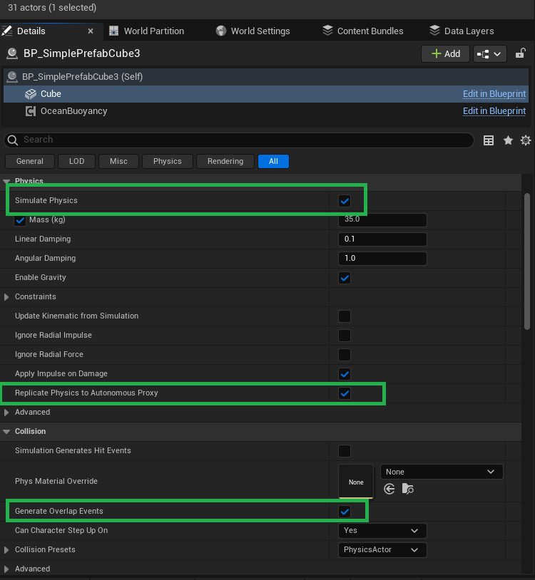
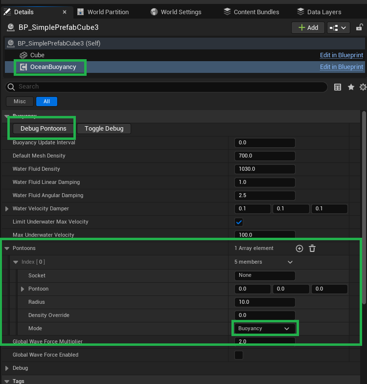
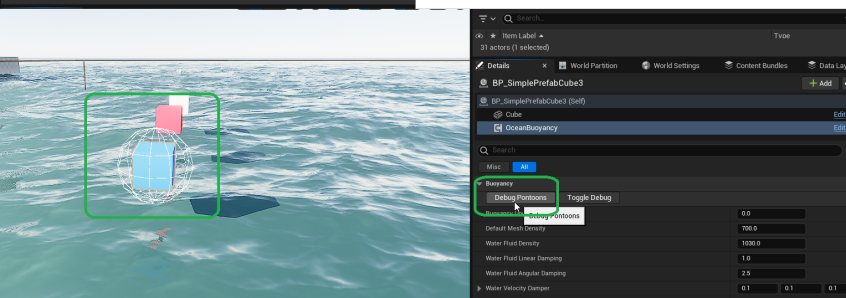

# Buoyancy

Before proceeding any further, first please read this documentation [Water Volume](./water-volume.md)

Oceanology uses the **OceanBuoyancyComponent** to make an actor buoyant in your scene. This is an Actor component, so you can plug it into ANY actor theoretically. We have tested the functionality of this component with AStaticMeshActor, ASkeletalMeshActor and simple AActor.

## Quick Start
* Add **OceanBuoyancyComponent** into your Actor.
* Add at least ONE (or more) pontoon to your **OceanBuoyancyComponent**. Make sure the pontoon's mode is set to "Buoyancy". You can use the "Debug Pontoons" button under the **OceanBuoyancyComponent** of your actor inside the editor to see where your pontoons are placed around the mesh.
* Add a Static or Skeletal mesh component into your Actor. The "DefaultSceneRoot" component (if exists) has to be removed by making the Static or SkeletalMesh component the **ROOT component** of your actor.
* Under the "Collision" section you must turn ON the "Generate Overlap Events" section. There you must also make sure your mesh collision settings are able to collide with the Water Volume. As a reference you can check (or directly use) the "PhysicsActor" collision preset.
* If you want the physics to be replicated under the "Physics" section you have to turn ON the "Replicate Physics to Autonomous Proxy" option.
* Also under the "Physics" section you have to turn ON the "Simulate Physics" option.
* Be aware that the mass of the mesh component may alter the buoyancy behavior as well.

## Example for Quick Start

## Explanation
* There are several options inside the **OceanBuoyancyComponent** to fine-tune the buoyancy of an actor, most of them have tooltip with explanation - and some don't but are self-explanatory. You may experiment with changing them, but radical variables may alter the behavior in an unwanted manner. So changes with caution!
* Most of the users only need to add Pontoons to their mesh inside their **OceanBuoyancyComponent**.
* There is a way to enable live debug spheres for the pontoons under the "Debug" section, but be aware drawing debug circles has an impact on performance. It is only recommended to be used for debugging and testing.
* There is a way to make global wave forces to impact the buoyancy, there is a configuration for that.
* There is a configuration to alter the buoyancy update interval, it will improve your performance, but cause delayed buoyancy with inaccuracy. Some users may prefer this, some users may not. This is the **Buoyancy Update Interval** configuration.
