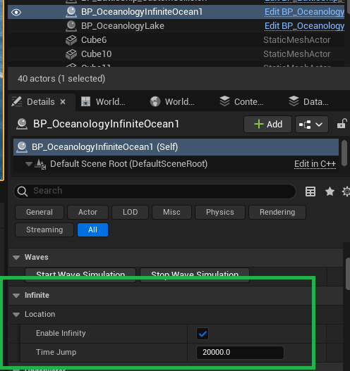
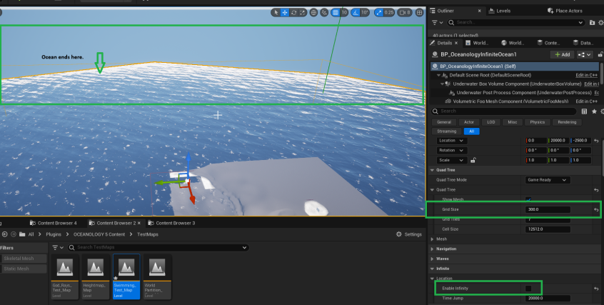

# Infinite

The infinite related options can be found under the "Infinite" section inside the Ocean's class. Oceanology uses "origin shifting" technology to achieve the infinite ocean effect. That means the origin of the actor is being relocated as you move your camera. You can notice the effect while moving inside the editor/in-game you will see the "XY" axis of the actor is constantly changing. The "Z" axis is not affected, because the "Z" represents the water level of the Ocean.

## Explanation of the options
* Enable Infinity - by default it is "true", by ticking off the checkbox you can set it to "false" disabling the infinity.
* Time Jump - It is used during the origin shifting actor snapping. Can be used to fine-tune the infinity effect, however I recommend using the default value.

## Smaller Oceans & Seas
If you desire to make a "smaller ocean/sea" you need to turn off the "Enable Infinity" option, and also reduce the Grid Size in the QuadTree.

Please see the image below to achieve this:

