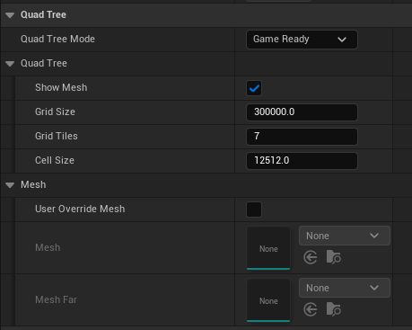

# QuadTree
Oceanology uses a QuadTree to generate the "water plane" mesh. The big infinite Ocean is not just a "simple plain water plane" as it would cost a lot of performance. We use the QuadTree logic to optimize performance to a gameplay acceptable level.

The Oceanology procedural quadtree utilizes UHierarchicalInstancedStaticMeshComponent to construct the Grid Mesh. Outside of the Grid Mesh we use a "Far Mesh" component which is a simple UStaticMeshComponent to provide a distance mesh for distant view. It uses a different material logic for better performance.

For more information about QuadTree please read this: https://en.wikipedia.org/wiki/Quadtree

## The Actor Panel options of The QuadTree

## Explanation of the options
* Show Mesh - used to show and hide the mesh
* Grid Size - used to configure the size of a single grid
* Grid Tiles - used to configure the number of grid tiles
* Cell Size - used to configure quad tree cell's size

## Modes
The Quad Tree Mode defines the Mesh's quality that is used to render the Ocean Surface.
The Quality Mode of the quad tree affects the Waterline's (water cutoff effect) precision.

We support 3 quadtree modes:
* Game Ready (default) - this is the most performance friendly 
* Simulation - better quality, but costs performance
* Render - even greater quality, but costs more performance

## Mesh User Override
If you don't want to use the default quad tree system but use a custom mesh, you can by ticking on "User Override Mesh" box which will let you specify a "Mesh" and a "Mesh Far" option to override/overwrite the default quadtree quality mesh selection behavior.