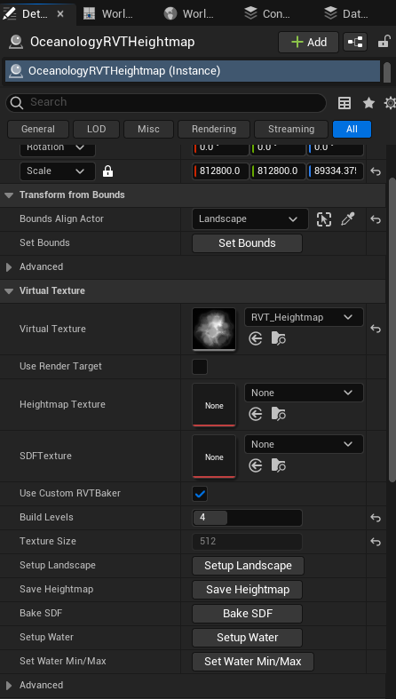

# RVT Heightmap Actor Manager
The RVT Heightmap Actor is responsible for virtual texture-based capturing of Landscape to produce shoreline foam and landscape ocean exclusion. This also serves as a utility tool for several ocean-related captures.

RVT is the most correct way to capture the Height of the Landscape including Location positioning and scaling. This way we can make sure that the Heightmap is correctly interacting with the Landscape. This way you can also create a new height map for your landscape quickly that Oceanology will use.

The Ocean and Lake uses the T_Heightmap which is a static texture. This texture is generated by the RVT heightmap actor. Please read the guide below to do so.

## Overview

## Quick Start
* Enable Virtual textures in your project settings.
* Create a landscape, do some sculpting or import a heightmap.
* Setup a Landscape material that feeds RVT with some data. (Take a look at **M_Landscape_RVT** in Oceanology examples)
* Drag & drop an ocean and some lakes to your scene.
* Drag & drop the Oceanology RVT Heightmap actor to your scene.
* Change the "Bounds Align Actor" of your Oceanology RVT Heightmap actor to your landscape.
* Press "Setup Landscape" button.
* Press the "Set Bounds" button. Make sure the yellow box of the actor covers your whole landscape. If you have multiple landscapes you have to scale it manually to cover all extra landscapes.
* Change the "build level" to "4" or "5" depending on your taste, and press the "Build" button. Build Level 12 is really expensive, and you do not need that high quality. Level 4 is sufficient for most use cases.
* Press the "Save Heightmap" button and choose a path for your Heightmap Texture. By default it is the level name. Do the same with "Bake SDF".
* Press "Setup Water" button.
* Press "Set Water Min/Max" button.
* Save your scene and start playing with the "RVT" category of your water bodies. (Both Ocean and Lake has these options.) Adjusting Depth for foam should be the number one option to play with.

