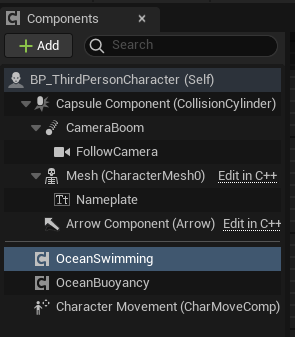
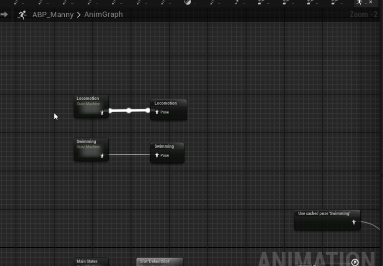
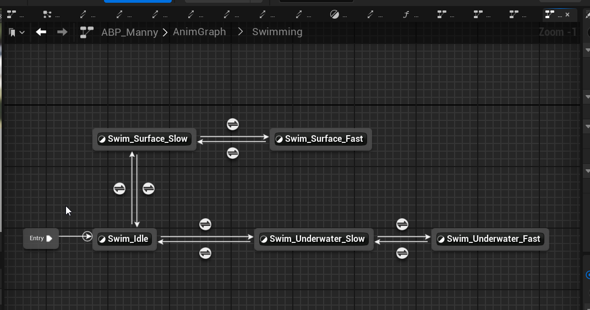

# Swimming

Before proceeding any further, first please read this documentation [Water Volume](./water-volume.md) and [Buoyancy Configuration](./buoyancy-configuration.md).

In order to "swim" you will need to place a **WaterVolume with swimming enabled** in the area on the configured water body.

## Difficulty: Intermediate
The guide assumes the user has at least intermediate skills in Unreal Engine involving:
1. setting up AnimBP with or without re-targeting
2. working with any actor components
3. assigning and using custom blueprint events
4. setting up input control via Enhanced Input system

## About Swimming System
Oceanology uses buoyant swimming to provide a semi-realistic swimming experience to the users. Therefore in order to setup swimming, first you need to drag and OceanBuoyancyComponent to your character. Read the [Buoyancy Configuration](https://github.com/Galidar/Oceanology/wiki/Buoyancy-Configuration) documentation first for more information about buoyancy.

Buoyant swimming means that your character gently floats towards the surface of the water (this behavior can be controlled via the SwimmingBuoyancyForceMultiplier, using value "0" disables that behavior), and when your character drowns to death as per the BP_ThirdPersonCharacter example it will ragdoll float towards the water surface.

Setting up the "swimming system" itself is actually easy, but setting up the AnimBP is a lot harder, as it is different for each user and each use case.

## Quick Start
Before proceeding any further, I recommend you to take a look at how BP_ThirdPersonCharacter is setup in the Oceanology demo example.

1. Open your character class. (For example BP_ThirdPersonCharacter)
2. Add OceanBuoyancyComponent to your character class and setup 2 pontoons such as "FullBody" and "Head".
   * The "FullBody" pontoon must be of "Mode" set to "Buoyancy" and it's center should be in the middle of your character.
   * The "Head" pontoon must be of "Mode" set to "Water Enter Exit Event Only" and it should be placed on the head of your character.
   * You can turn on "Draw Debug Spheres" option of the Buoyancy component to visualize the spheres you configured. If the spheres are at their right location the Buoyancy part is finished.
3. Add OceanSwimmingComponent to your character class.
4. Make sure the "Buoyancy Pontoon Socket for Enter Water Event" inside the OceanSwimmingComponent is the same as the "Head" pontoon's name. By default it's "Head" so it should be fine.
5. If you want replicated system you must turn on "Component Replicates" flag on both OceanBuoyancyComponent and OceanSwimmingComponent.
6. Now that both buoyancy and swimming is configured, you need to setup the input controls. You can check the BP_ThirdPersonCharacter of Oceanology demo to inspire yourself, but eventually this part is different per each user.
7. Now the last and hardest part: The Anim BP.
   * Inside the Character/Mannequins/Animations directory there is an ABP_StateObject class, it is a simple UObject to store all "swimming states" - this is a standard and recommended approach to store states for animation blueprints. Open this class and study it. You can inspire from it to create your own state class, or just copy this one. It is up to the user.
   * You then open the ABP_Manny anim blueprint, there you will see a function called "InitStateObject" and a variable called "StateObject" - this is how the "swimming states" are linked to the animation.
   * Looking at AnimGraph -> Swimming and it's states you may study how this works. The states are linked to the Anim Rules via "Property Access" from the aforementioned "StateObject".
   * You need to create a similar Swimming graph in your own character's AnimBP and link the states via "Property Access" (right click in Anim BP -> Search "Property Access" -> reference StateObject and it's fields) of each swimming state.
   * The easiest approach here is to study each swimming state and each swimming animation of the Oceanology demo and then setting up it with your own character.
   * You can also just copy the anim graph from Oceanology and the state object and customize it to your needs. This approach only works however with mannequin-alike humanoid characters. Custom animations requires further fine-tuning with the states.

## Controls
* **REQUIRED:** You need to check "Movement Input" section of the BP_ThirdPersonCharacter. The right/left and forward/backward water movement logic is there.
* OPTIONAL: You need to check "Surface Locked Swimming" section of the BP_ThirdPersonCharacter.
* OPTIONAL: You need to check "Swim Fast" section of the BP_ThirdPersonCharacter.
* OPTIONAL: You need to check "Swim Up / Swim Down" section of the BP_ThirdPersonCharacter.

## Settings
Most of the Oceanology swimming settings have a tooltip to explain their usage, if not they are self-explanatory. I will describe some of the settings here only.

Please note _**most of use-case scenarios can be covered by copying the Oceanology demo's BP_ThirdPersonCharacter settings in both Buoyancy and Swimming components**_. This is the "quick & short" setup scenario. However, Oceanology provides several options to fine-tune swimming for each unique characters of size and complexity. Some custom character will need animation retargeting, meanwhile other custom characters will only require Pontoon size and location adjustments.
The swimming system takes into account the character's collision capsule heights, so each custom character may be required to fine-tune that as well.

* With the "Debug Enabled" option you can see most of the swimming states, spheres, and debug messages that is useful for investigating a specific characteristic of the swimming system or potentially identifying a bug. This option is for Advanced users. This can be combined with the Buoyancy debug options as well.
* There is an "Underwater" section to control the counters that drive the underwater events. Inside the "Effects" subsection of the "Underwater" section you can change the swimming bubble niagara effects, and setup their socket locations. Please note, your character's skeleton is required to have the sockets created to make the effects work. Please look at oceanology mannequin skeleton for that. There is also an option here to control the swim trail sound under the "Sound" subsection.
* The "Controls" section has movement alteration options, these options are only active during swimming, when you stop swimming the original movement component's settings are restored.

## Events
Please take a look at the "UserExampleGraph" of the BP_ThirdPersonCharacter of Oceanology demo.

This demonstrates the custom assignable events of the Oceanology swimming and visualizes them on an Example user HUD. Each swimming state and special swimming and water related event has a custom assignable event to have maximum customization for the user.

These events can be used to customize swimming with additional business logic of the user. That can be playing a sound, printing debug messages, playing some random animation or setting a variable. Basically anything the user desires.

