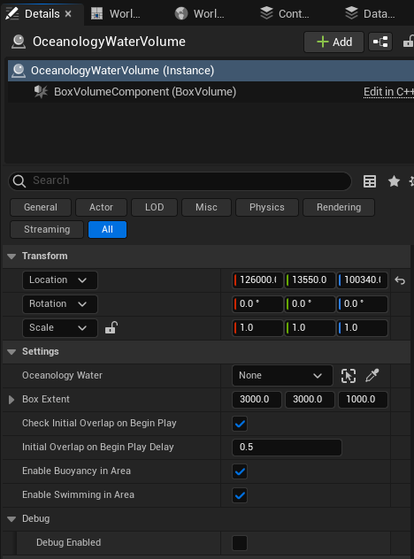

# Water Volume

A water volume in Oceanology is a Box to control physics and swimming. Multiple water volumes can be placed in a scene depending on the amount of water bodies you want to spawn and on the size of the area you wish to set swimmable and buoyant.

It is very important that you must have "Generate Overlap Events" enabled on your objects you want to make buoyant/swimmable, and they must have at least a basic collision settings allowing overlap events. Please see the demo levels for example.

## The panel

## The Options
* The "Oceanology Water" is a required parameter of this actor. Without this the volume will NOT work.
  * You need to pick a water body from your scene here. This is either the **infinite ocean** itself or one of your **lakes**.
  * Please be aware if you want to place 10 swimmable/buoyant lakes in your scene and an ocean, you will need 11 water volumes at least for them.
  * Though if you wish to cover 4 parts (shores you might say) of the Ocean, you will need 14 water volumes then. 10 volumes for the lakes, and 4 volumes for each shore.
  * It all depends on user's taste how much part of the ocean or the lakes the user wants to cover with physics.
* The "Box Extent" is the option to control the size of the volume on a vector. (XYZ)
* The volume supports an "initial overlap check" that happens on BeginPlay after a little delay. This can be altered or turned off. This option iterates over all actors in your scene and checking for overlap events. Turning off may lead some actors not overlapping after BeginPlay.
* The "Enable Buoyancy In Area" controls whether there buoyancy components of actors and characters with UOceanBouyancyComponent will work or not in the area or not.
* The "Enable Swimming in Area" controls whether the volume is a swimmable area or not. If "True" the system automatically spawns a water PhysicsVolume with the same scale/location/rotation of the water volume. This affects characters with UOceanSwimmingComponent.
* The "Debug Enabled" option will display the bounds of the box in game and send PrintString messages when overlap events happen.