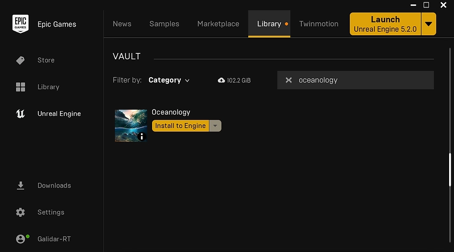
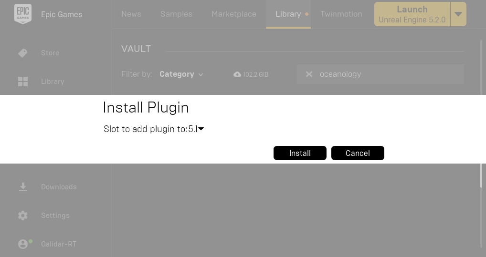
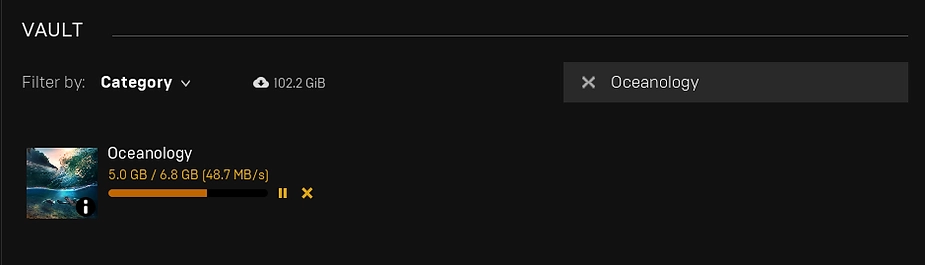

# Installation Guide

Provides a step-by-step guide to install and configure the Oceanology engine plugin for your Unreal Engine project. This step will run you through how to install the plugin to unreal engine.

<figure markdown="span">
  
  <figcaption>Open Launcher and navigate to the library section then look for Oceanology plugin</figcaption>
</figure>

<figure markdown="span">
  
  <figcaption>Once the engine version is selected, the installation of the add-on will begin.</figcaption>
</figure>

<figure markdown="span">
  
  <figcaption>Installation of the plugin will begin.</figcaption>
</figure>