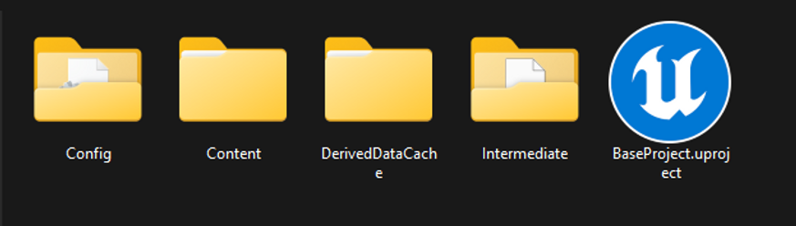
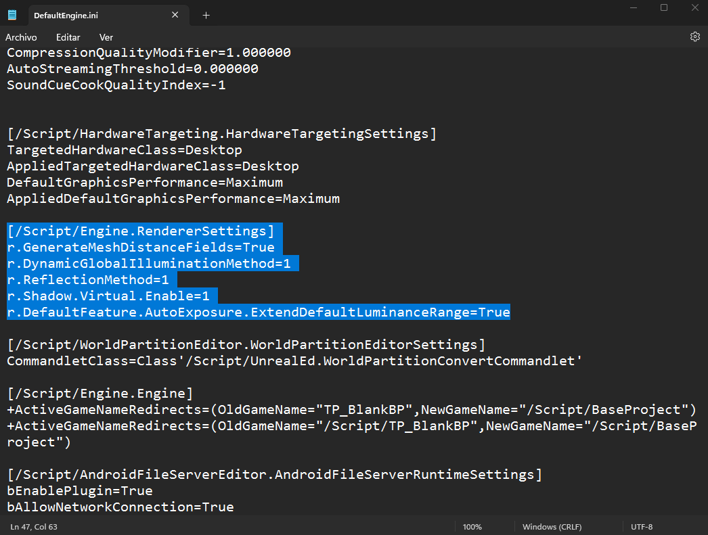
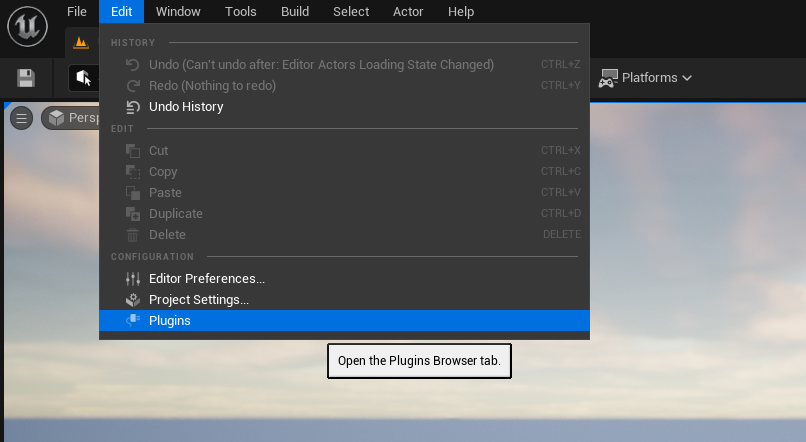
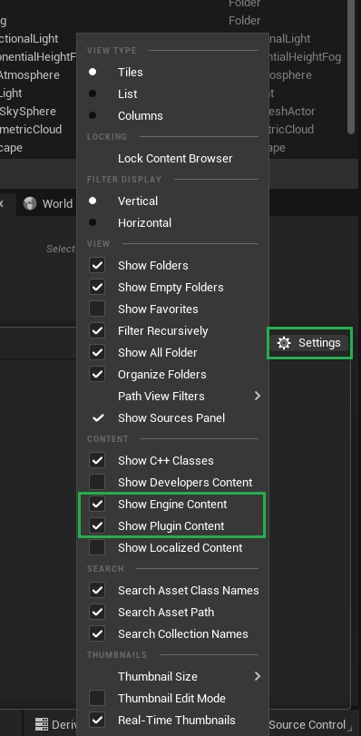

# Setup Guide

Provides a step-by-step guide to setup Oceanology requirments. If you need help adding Oceanology to your scene after all requirements have been configured video here [TODO VIDEO] 

!!! note

    Before integrating Oceanology into your main project, generating a test project is recommended.

Before jumping into it lets create a new Unreal third person sample project. You may name it what you wish.

<figure markdown="span">
  
  <figcaption>Lets create a test project. Next we have to update the defaultengine.ini file.</figcaption>
</figure>

<figure markdown="span">
  
  <figcaption>Navigate to file explorer and find your project root</figcaption>
</figure>

<figure markdown="span">
  
  <figcaption>Open Config folder and open DefaultEngine.ini.</figcaption>
</figure>

<figure markdown="span">
  
  <figcaption>Find Engine.RendererSettings section and update it as following</figcaption>
</figure>

---

### DefaultEngine.ini

These settings are important to make sure that your render settings play nice with oceanology. Feel free to merge your custom settings with the requirments below but keep in mind we can't test all settings so if you experience issues feel free to head over to our discord community.

!!! note

    Important code may vary depending on the version of the engine. This code is used to correct rendering problems, such as strange artifacts and blinking when moving a plane.

``` ini
[/Script/Engine.RendererSettings]
r.GenerateMeshDistanceFields=True
r.DynamicGlobalIlluminationMethod=1
r.ReflectionMethod=1
r.Shadow.Virtual.Enable=1
r.DefaultFeature.AutoExposure.ExtendDefaultLuminanceRange=True
r.DefaultFeature.LocalExposure.HighlightContrastScale=0.8
r.DefaultFeature.LocalExposure.ShadowContrastScale=0.8
```

Next open your project you created above from the launcher and navigate to the plugins settings

---

<figure markdown="span">
  
  <figcaption>Navigate to the plugin settings</figcaption>
</figure>

<figure markdown="span">
  
  <figcaption>Look for the Oceanology and enable it</figcaption>
</figure>

<figure markdown="span">
  
  <figcaption>Restart when prompted</figcaption>
</figure>

<figure markdown="span">
  
  <figcaption>Enable plugin content visibility as these may be hidden by default.</figcaption>
</figure>

<figure markdown="span">
  
  <figcaption>Navigate to plugin content for demo levels and files</figcaption>
</figure>
